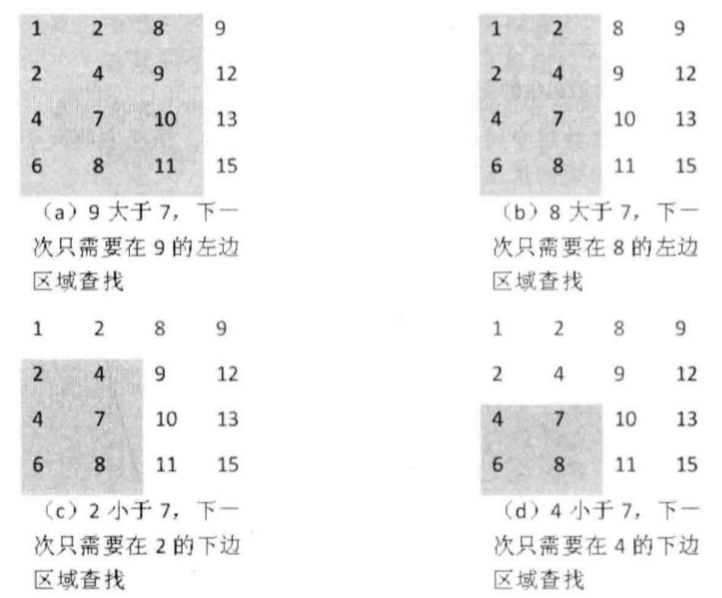

题目描述
在一个二维数组中（每个一维数组的长度相同），每一行都按照从左到右递增的顺序排序，每一列都按照从上到下递增的顺序排序。请完成一个函数，输入这样的一个二维数组和一个整数，判断数组中是否含有该整数。

编写一个高效的算法来搜索 m x n 矩阵 matrix 中的一个目标值 target。该矩阵具有以下特性：

每行的元素从左到右升序排列。
每列的元素从上到下升序排列。
示例:
比如在下面的二维数组中查找数字7，查找过程如下：

二维数组中的查找

给定 target = 7，目标值 7 在这个数组中，返回 true 即可。

给定 target = 20，目标值 20 不在这个数组中，需要返回 false 。

题目分析
这个二维数组是有特点的：

每一行都是递增的
每一列都是递增的

首先，我们初始化一个指向矩阵右上角的 元素 。

从这个元素开始查找，如果这个元素比 target 大，则说明需要找更小的，往左走；如果这个元素比 target 小，则说明应该找更大的，往下走。